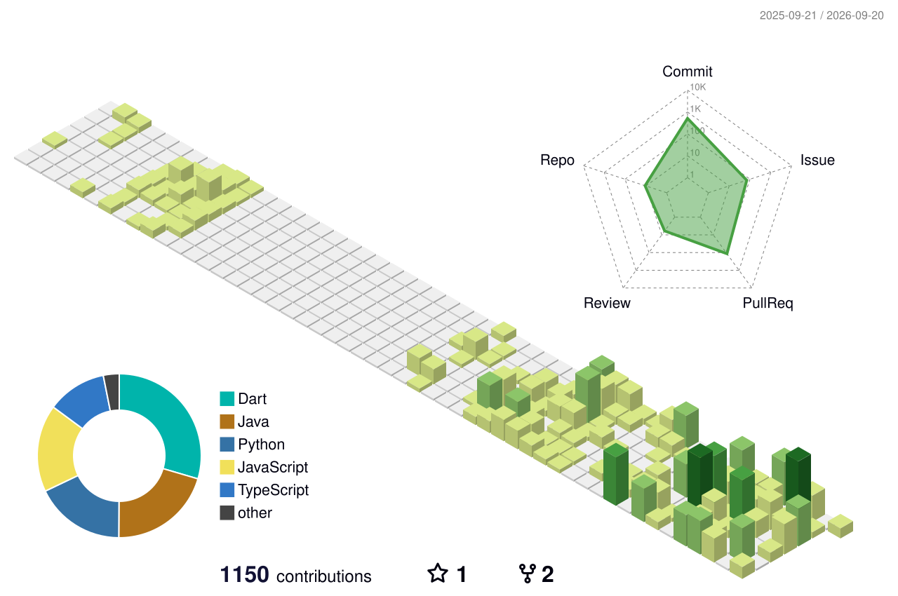

<h1 align="center">Jinhyeong Jeong</h1>

  <strong>AI Product Builder · Backend & Full-stack Developer</strong>

  I turn practical problems into working products with AI, data, and reliable backend systems.

  
  
  

## About

Software Convergence student on the Data Science track, building AI-powered web, mobile, and developer tools. I focus on making AI useful inside a complete product: from API design and data modeling to asynchronous workers, deployment, and the final user flow.

Currently working on:

- **Leafie** — an iOS plant-care app with AI chat, photo diagnosis, automated care schedules, and push notifications
- **OpenBrief** — a local-first open-source tool that turns scattered project context into evidence-backed briefs
- **QuizHub** — an AI-powered platform for generating, managing, and sharing exams from learning materials

## Featured Work

| Project | What it does | Stack |
| --- | --- | --- |
| [OpenBrief](https://github.com/JH-9568/OpenBrief) | Collects project context from Figma, Notion, Discord, and GitHub, then creates reviewable AI briefs locally | Python · FastAPI · SQLite/PostgreSQL · Celery · OpenAI |
| [Leafie](https://github.com/YuEngMe/Leafie) | Helps users care for plants through character-based records, recurring schedules, AI chat, and photo diagnosis | Python · FastAPI · Supabase · OpenAI · Flutter |
| [PromptLab Extension](https://github.com/JH-9568/PromptLab-Extension) | Improves prompts directly inside ChatGPT, Gemini, and Claude while collecting privacy-conscious quality signals | JavaScript · Node.js · Supabase · OpenAI |
| [QuizHub](https://quizhub.kr) | Generates and manages study questions from lecture materials and documents | Next.js · TypeScript · Prisma · Supabase · OpenAI |

## More Projects

- [Moods](https://github.com/JH-9568/Moods) — a Flutter app that records study sessions and recommends spaces based on mood and environment
- [PromptLab](https://github.com/JH-9568/PromptLab) — a collaborative PromptOps platform with prompt versioning, teams, and RAG-based suggestions
- [LLM Service](https://github.com/JH-9568/docker-to-k8s-ollama-service) — an asynchronous FastAPI, Redis, and Ollama service deployed with Docker Compose and Kubernetes
- [KHUTHON App](https://github.com/JH-9568/khuthon-app) — a Flutter and FastAPI hackathon MVP for comparing eating-out and home-cooking costs

## Tech

  
  
  
  
  
  
  
  
  
  
  
  

## Contributions

<picture>
  <source media="(prefers-color-scheme: dark)" srcset="./profile-3d-contrib/profile-night-green.svg" />
  <source media="(prefers-color-scheme: light)" srcset="./profile-3d-contrib/profile-green-animate.svg" />
  
</picture>
