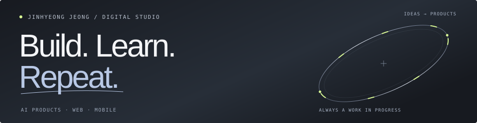

### 정진형 · Jinhyeong Jeong

AI 제품과 웹·모바일 서비스를 만들고, 피드백과 데이터로 개선합니다. 
경희대학교 소프트웨어융합학과 · 데이터사이언스 트랙

[**Portfolio ↗**](https://jinhyeong-studio.jinhyeong9568-663.workers.dev) &nbsp; / &nbsp; [Journal](https://jinhyeong-studio.jinhyeong9568-663.workers.dev/blog) &nbsp; / &nbsp; [Email](mailto:jinhyeong9568@gmail.com)

---

#### SELECTED WORK

- **[PromptLab Extension](https://jinhyeong-studio.jinhyeong9568-663.workers.dev/projects/promptlab-extension)** — AI 채팅에서 바로 쓰는 프롬프트 개선 도구
- **[부여ON](https://jinhyeong-studio.jinhyeong9568-663.workers.dev/projects/buyeo-on)** — 디지털 군민증과 퀴즈로 시작하는 지역 여행
- **[QuizHub](https://jinhyeong-studio.jinhyeong9568-663.workers.dev/projects/quizhub)** — 강의 자료를 함께 풀 수 있는 퀴즈로
- **[Leafie](https://github.com/YuEngMe/Leafie)** — 기록·관리 일정·AI 진단을 연결한 식물 관리
- **[Mr.Park](https://mrpark.ai.kr/)** — 사람과 AI의 주행을 실험하는 3D 웹 서비스
- **[찍어줄게](https://jinhyeong-studio.jinhyeong9568-663.workers.dev/projects/jjigeojulge)** — 구도와 촬영 조건을 확인하는 자동 촬영 iPhone 앱

More projects — AI tools, apps & experiments

**AI & Tools** — [Rigmetry](https://github.com/JH-9568/rigmetry) · [OpenBrief](https://github.com/JH-9568/OpenBrief) · [PromptLab](https://github.com/JH-9568/PromptLab) · [Ollama LLM Service](https://github.com/JH-9568/docker-to-k8s-ollama-service)  
**Apps** — [Moods](https://github.com/JH-9568/Moods) · [TeamApp](https://github.com/JH-9568/TeamApp) · [KHUTHON](https://github.com/JH-9568/khuthon-app)

---

WORKING WITH &nbsp; Python · TypeScript · Next.js · FastAPI · Flutter · SwiftUI
